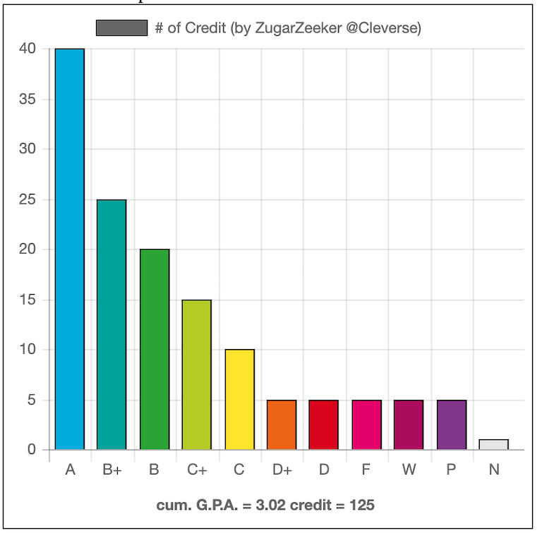

# ku-grade-chart
show grade with beautiful chart in transcript

## Screenshot

## How to use ?
1. copy script from [here](http://bit.ly/ku-grade-chart-script)
2. right click @grade report page (std.regis)
3. inspect
4. click console
5. paste & enter
6. capture your grade chart
7. share :)
