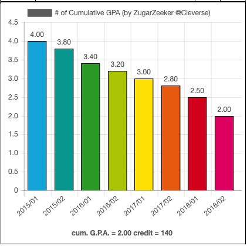

ku-grade-chart
================================

`KU-grade-chart` เป็นเครื่องมือในการนำเสนอผลการเรียนด้วยแผนภูมิที่สวยงาม และง่ายต่อการวิเคราะห์ภาพรวมผลการเรียนของตัวเอง โดยใช้ข้อมูลจากผลการเรียน/ทรานสคริท์ที่มีอยู่แล้วใน[เว็บรีจิส](https://stdregis.ku.ac.th) เพื่อง่ายต่อการใช้งานและการทำความเข้าใจ และไม่มีขั้นตอนอะไรที่ซับซ้อนมาก

## วิธีการใช้งาน
1. คัดลอกสคริปท์ที่ได้มาจาก[ลิงค์นี้](http://bit.ly/ku-grade-chart-script) หรือดูแนวโน้มเกรดแต่ละเทอมที่[ตรงนี้](https://raw.githubusercontent.com/zugarzeeker/ku-grade-chart/master/cumulative-grade-chart.js)
2. เข้า[เว็บรีจิส](https://stdregis.ku.ac.th) คลิกที่รายงานผลการเรียน
3. กดปุ่ม F12
4. เข้าไปที่หัวข้อ คอนโซล/Console
5. กดปุ่ม Ctrl+V แล้วกด Enter
6. แคปกราฟเอาไปขิงกับเพื่อน หรือให้พ่อแม่ที่บ้านดูก็ได้นะ
7. แชร์ [http://bit.ly/ku-grade-chart-how-to](http://bit.ly/ku-grade-chart-how-to) ต่อจะเป็นพระคุณอย่างสูงครับ :)
แถม แจ้งบั๊กจะรักนะ

================================
### version 1.2 (7 Jun 2019)
มีอัพเดทเพิ่มแหละ นอกจากจะดูเกรดรวมแล้ว สามารถดูแนวโน้มของเกรดแต่ละเทอมได้ด้วยนะ โดยคัดลอกสคริปท์[ตรงนี้](https://raw.githubusercontent.com/zugarzeeker/ku-grade-chart/master/cumulative-grade-chart.js)แทน แต่ขั้นตอนเหมือนเดิมเลย

### version 1.1 (6 Jun 2019)
เอามาปัดฝุ่น เริ่มเดบิวท์เปิดให้ใช้งานกันทั่วไปแล้วนะ แต่ก็มีแก้บั๊กตอนคำนวณเกรดนิดหน่อย ปรับปรุงให้readmeอ่านง่ายขึ้นด้วยแหละ

### version 0.2 (12 Jun 2016)
จัดหน้าตาให้กราฟสวยและอ่านง่ายขึ้น มีแสดงเกรดเฉลี่ยโดยรวมทั้งหมด

### version 0.1 (26-27 May 2016)
สร้างเครื่องมือนี้ขึ้นมาแบบลับๆ ยังไม่อยากให้แมส กลัวบั๊กเยอะ
