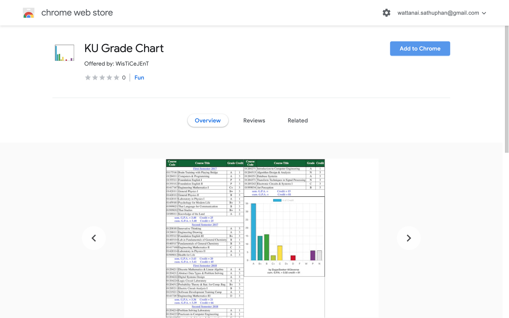
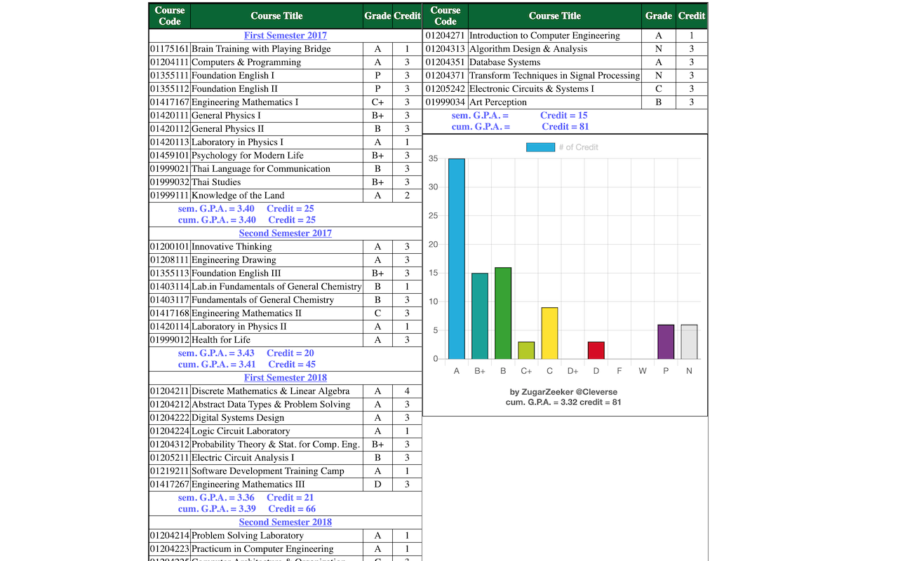

Google Chrome Extension for ku-grade-chart
================================

แค่คลิกเดียวก็มีชาร์ทสวยๆอวดเพื่อนได้ 

สามารถอ่านข้อมูลของ `KU-grade-chart` ได้จาก[หน้านี้](https://github.com/zugarzeeker/ku-grade-chart/blob/master/README.md)

## วิธีการใช้งาน (สำหรับผู้ใช้ Google Chrome)

1. เข้าไปโหลด Extension ใน [chrome web store](https://chrome.google.com/webstore/detail/ku-grade-chart/mpnamogehidfbeheklpofdfdnihjealn)   
2. กด `เพิ่มใน Chrome` หรือ `Add to Chrome` (ปุ่มสีน้ำเงินฟ้าทางขวามือบน)  
3. เข้า[เว็บรีจิส](https://stdregis.ku.ac.th) คลิกที่รายงานผลการเรียนตามปกติ  
4. แคปไปอวดเพื่อนๆ พ่อแม่ และป้าข้างบ้านได้เลยจ้า อวดเพื่อนแล้วก็อย่าลืม[แชร์ต่อให้เพื่อน](https://bit.ly/ku-grade-chart-extension)ด้วยนะ   

